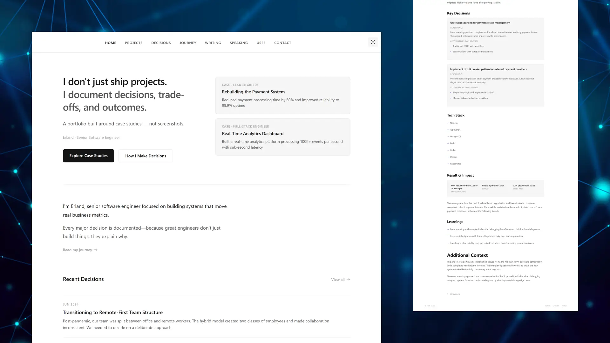
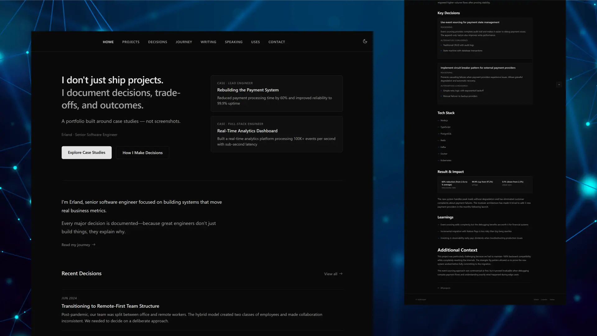

# Case — A Case-Study-First Portfolio Theme for Astro

[](https://astro.build)
[](https://opensource.org/licenses/MIT)

A case-study-first portfolio theme for Astro. Designed for professionals who want to showcase their thinking, decisions, and real impact—not just screenshots and tech stacks.

## Why Case?

Most portfolio themes focus on listing projects with screenshots and bullet points. Case takes a different approach: it treats every project as a case study with a structured narrative—problem, constraints, approach, key decisions, and measurable outcomes.

This lets you demonstrate not just what you built, but how you think. Hiring managers and clients see your decision-making process, trade-offs you considered, and the real impact of your work. You stand out by showing depth, not just breadth.

## Demo

<div align="center">

[](https://case.erland.me)

<table>
  <tr>
    <td width="50%">
      
      <p align="center"><em>Light Mode</em></p>
    </td>
    <td width="50%">
      
      <p align="center"><em>Dark Mode</em></p>
    </td>
  </tr>
</table>

</div>

## Features

### Case Studies Over Screenshots

Document your engineering thinking with structured project narratives.

- **Problem → Solution framework**: Context, constraints, approach, and measurable impact
- **Decision documentation**: Trade-offs, alternatives, and reasoning behind key choices
- **Quantified outcomes**: Performance improvements, team impact, and business results
- **Strategic highlighting**: Feature your strongest work on the homepage

### Built-in Decision Records

Document architectural decisions with full context and alternatives.

- Problem statement and background context
- Options considered with trade-off analysis
- Chosen approach with reasoning
- Outcomes and learnings
- Tag-based organization and filtering

### Content Types for Technical Portfolios

Purpose-built collections for engineering professionals.

- **Projects** — Deep-dive case studies with structured narratives
- **Decisions** — ADR-style technical decision logs
- **Journey** — Career milestones, transitions, and key learnings
- **Writing** — Technical articles with auto-generated TOC
- **Speaking** — Talks, podcasts, and workshop materials
- **Tools** — Tech stack and development environment
- **Testimonials** — Peer and client recommendations

## Quick Start

### 1. Create a new project

```bash
npm create astro@latest -- --template erlandv/case
```

### 2. Configure your site

```bash
cp .env.example .env
# Edit .env with your information
```

### 3. Start development

```bash
npm run dev
```

Your site is now running at [http://localhost:4321](http://localhost:4321)

## Documentation

Full documentation is available in the [`docs/`](./docs/) folder:

### Getting Started
- [Installation](./docs/01-getting-started/installation.md) — Prerequisites and setup
- [Quick Start](./docs/01-getting-started/quick-start.md) — See results in 5 minutes
- [Project Structure](./docs/01-getting-started/project-structure.md) — Understand the codebase

### Configuration
- [Configuration](./docs/02-configuration/configuration.md) — Environment variables, navigation, favicons

### Content
- [Content Guide](./docs/03-content/content-guide.md) — All content types and schemas
- [Templates](./docs/03-content/templates.md) — Copy-paste templates for quick content creation
- [Images](./docs/03-content/images.md) — Image handling and optimization
- [Content Strategy](./docs/03-content/content-strategy.md) — Best practices for featured content

### Customization
- [Styling](./docs/04-customization/styling.md) — Colors, typography, spacing, breakpoints
- [Components](./docs/04-customization/components.md) — Modifying and creating components
- [Advanced](./docs/04-customization/advanced.md) — Layouts, new content collections

### Deployment
- [Deployment](./docs/05-deployment/deployment.md) — Build and deploy to various platforms
- [Post-Deployment](./docs/05-deployment/post-deployment.md) — Verification checklist

### Reference
- [Troubleshooting](./docs/06-reference/troubleshooting.md) — Common issues and solutions

## License

Case Theme is free for personal and commercial use under the [MIT License](./LICENSE). Attribution is not required, but a link back to this repository is always appreciated if you find the theme useful.
